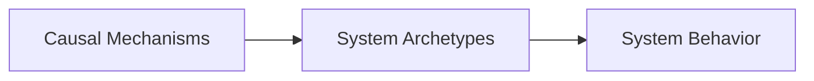

# Definitions: Causal Mechanisms and System Archetypes

Understanding complex systems requires distinguishing between **causal mechanisms** and **system archetypes**.

Both play different but complementary roles in structural system analysis.

---

# Causal Mechanisms

## Definition

A **causal mechanism** is a structural process that explains **how and why a particular outcome emerges within a system**.

Mechanisms describe the **cause-and-effect relationships that drive system behavior**.

They operate at the **micro-structural level** of systems.

---

## Example Mechanism


Each step represents a **causal mechanism operating within the system**.

---

## Characteristics of Mechanisms

Causal mechanisms typically describe:

* structural forces within systems
* cause–effect relationships
* behavioral dynamics
* local interactions between system components

Mechanisms answer the question:

```text
What processes are driving the system behavior?
```

---

# System Archetypes

## Definition

A **system archetype** is a recurring structural pattern that emerges when multiple causal mechanisms interact within a system.

Archetypes describe **common system behavior patterns observed across many domains**.

They operate at the **macro structural level** of systems.

---

## Example Archetype


Archetype:

```text
Limits to Growth
```

This pattern appears repeatedly across:

* organizations
* infrastructure systems
* markets
* technology platforms

---

# Relationship Between Mechanisms and Archetypes

Mechanisms combine to produce archetypes.



Example:


Here:

* **Growth**, **Coordination Complexity**, and **Decision Bottleneck** are mechanisms
* **Limits to Growth** is the archetype produced by those mechanisms

---

# Why Both Mechanisms and Archetypes Are Needed

Studying only archetypes or only mechanisms is insufficient for understanding complex systems.

Both perspectives are required.

---

## Mechanisms Explain the "How"

Mechanisms explain **how a system evolves step by step**.

They provide detailed causal chains such as:

```text
Growth
→ Coordination Complexity
→ Decision Bottleneck
→ Slower Execution
```

Mechanisms enable analysts to:

* trace system behavior
* identify structural drivers
* diagnose root causes

---

## Archetypes Explain the "Pattern"

Archetypes explain **the structural pattern produced by mechanisms**.

For example:

```text
Limits to Growth
Escalation
Tragedy of the Commons
```

These patterns appear repeatedly across systems.

Archetypes allow analysts to:

* recognize familiar system patterns
* anticipate system outcomes
* generalize insights across domains

---

# Analogy

The relationship can be compared to **biology**.

| Biology           | Systems Thinking |
| ----------------- | ---------------- |
| Cells             | Mechanisms       |
| Organs            | Archetypes       |
| Organism Behavior | System Outcomes  |

Mechanisms operate like **cells**, while archetypes represent **higher-level structures**.

---

# Example: Platform Ecosystem Growth

Mechanism chain:


Archetype:

```text
Success to the Successful
```

The reinforcing loop is produced by the **network effect mechanism**.

---

# Example: Infrastructure Congestion

Mechanism chain:


Archetype:

```text
Growth & Underinvestment
```

Here, the archetype emerges from **growth and capacity lag mechanisms**.

---

# Role in the Elite Think Tank Training

Within the training program, drills train the ability to identify both:

```text
Mechanism Chain
↓
System Archetype
↓
System Outcome
```

This builds the capability for **structural system diagnosis**.

---

# Strategic Importance

Mastering both mechanisms and archetypes enables:

* deeper understanding of complex systems
* identification of structural system constraints
* diagnosis of organizational problems
* anticipation of system behavior
* identification of leverage points

These capabilities form the foundation of the **Causal Systems Diagnostics framework**.
